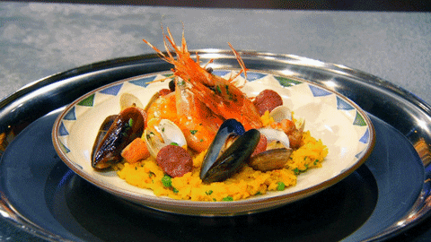

    

 

English | [Choose Language](./choose-language.md)

				

 

## Project Description
Now there are many seed banks all over the world. This seed bank is in case the world is destroyed and we have no source of plant seeds. So if the world is destroyed, and we grow food, but we've forgotten how to cook them, what should we do?
Now is the time to show the importance of our project. We want to collect all the recipes in the world!
If you read this far, please join us as we gather recipes from around the world in this github repository！

    

 

## There are some things we need to do to make the world better： 
**1.Save recipes from around the world to GitHub repository.** 
**2.Save recipes from GitHub to hard disk/CD/paper/stone/etc.** 
**3.Waiting for the world to end.** 
**4.Grow food.** 
**5.Get out the recipe, cook them and save the world!** 
 

## We need your help
**programmers and gastronomes**:Record the recipe in this github repository. 
**Programming language Designers**:Create a whole new programming language,**food-language**;In this way, programmers or gourmands can create an animated video through simple programming to demonstrate the process of food production. 
**Translators**:Translate recipes into different languages. 
**Others**:Keep all the recipes in your head, or copy this repository, and wait for the end of the world！ 
**...**
 

## Contact us
**telegram:**
https://t.me/ProgrammerAndCook
<table>
    <tr>
      <td align="center" style="width: 200px;">
        <a href="https://t.me/ProgrammerAndCook">
            
        </a> 
      </td>
    </tr>
</table>
 

**wechat:**
<table>
    <tr>
      <td align="center" style="width: 200px;">
        <a href="#">
            
        </a> 
      </td>
    </tr>
</table>
 

**twitter:**
Not yet
 
 

## A list of recipes that are currently available
**[Chinese Recipes](https://github.com/world-food/China-food)**
 
 

## Warning, this is very important!
1.There should be no human flesh in the ingredients！ 
2.Please put your country's special recipes in your country's repository. 
3.If the recipe is your own and you have tried it, please put the recipe in the World-food repository. 
